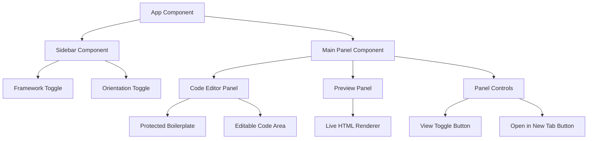

# Design Document

## Overview

The HTML Code Editor is a React-based web application that provides a split-panel interface for writing HTML code with live preview functionality. The application leverages the existing Vite + React + Tailwind CSS setup and adds code editing capabilities with framework switching and page layout management.

## Architecture

### High-Level Architecture



### Component Hierarchy

- **App**: Root component managing global state
- **Sidebar**: Left panel with framework and orientation controls
- **MainPanel**: Central area containing editor and preview
- **CodeEditor**: HTML code editing interface with protected boilerplate
- **PreviewPanel**: Live HTML rendering area
- **PanelControls**: Toggle buttons for view switching and new tab opening

## Components and Interfaces

### App Component
```javascript
// State management for global application settings
const [cssFramework, setCssFramework] = useState('tailwind') // 'tailwind' | 'bootstrap'
const [pageOrientation, setPageOrientation] = useState('portrait') // 'portrait' | 'landscape'
const [currentView, setCurrentView] = useState('editor') // 'editor' | 'preview'
const [htmlCode, setHtmlCode] = useState('')
```

### Sidebar Component
```javascript
// Props interface
{
  cssFramework: string,
  pageOrientation: string,
  onFrameworkChange: (framework: string) => void,
  onOrientationChange: (orientation: string) => void
}
```

### CodeEditor Component
```javascript
// Props interface
{
  htmlCode: string,
  onCodeChange: (code: string) => void,
  cssFramework: string,
  pageOrientation: string,
  protectedBoilerplate: string
}
```

### PreviewPanel Component
```javascript
// Props interface
{
  htmlCode: string,
  cssFramework: string,
  pageOrientation: string
}
```

## Data Models

### Boilerplate Templates

#### Tailwind CSS Template
```javascript
const tailwindBoilerplate = {
  portrait: `<!DOCTYPE html>
<html lang="en">
<head>
    <meta charset="UTF-8">
    <meta name="viewport" content="width=device-width, initial-scale=1.0">
    <title>HTML Preview</title>
    <script src="https://cdn.tailwindcss.com"></script>
    <style>
        @page { size: A4 portrait; margin: 1in; }
        body { width: 210mm; min-height: 297mm; }
    </style>
</head>
<body>
`,
  landscape: `<!DOCTYPE html>
<html lang="en">
<head>
    <meta charset="UTF-8">
    <meta name="viewport" content="width=device-width, initial-scale=1.0">
    <title>HTML Preview</title>
    <script src="https://cdn.tailwindcss.com"></script>
    <style>
        @page { size: A4 landscape; margin: 1in; }
        body { width: 297mm; min-height: 210mm; }
    </style>
</head>
<body>
`
}
```

#### Bootstrap Template
```javascript
const bootstrapBoilerplate = {
  portrait: `<!DOCTYPE html>
<html lang="en">
<head>
    <meta charset="UTF-8">
    <meta name="viewport" content="width=device-width, initial-scale=1.0">
    <title>HTML Preview</title>
    <link href="https://cdn.jsdelivr.net/npm/bootstrap@5.3.0/dist/css/bootstrap.min.css" rel="stylesheet">
    <style>
        @page { size: A4 portrait; margin: 1in; }
        body { width: 210mm; min-height: 297mm; }
    </style>
</head>
<body>
`,
  landscape: `<!DOCTYPE html>
<html lang="en">
<head>
    <meta charset="UTF-8">
    <meta name="viewport" content="width=device-width, initial-scale=1.0">
    <title>HTML Preview</title>
    <link href="https://cdn.jsdelivr.net/npm/bootstrap@5.3.0/dist/css/bootstrap.min.css" rel="stylesheet">
    <style>
        @page { size: A4 landscape; margin: 1in; }
        body { width: 297mm; min-height: 210mm; }
    </style>
</head>
<body>
`
}
```

### Application State
```javascript
const AppState = {
  cssFramework: 'tailwind' | 'bootstrap',
  pageOrientation: 'portrait' | 'landscape',
  currentView: 'editor' | 'preview',
  htmlCode: string,
  protectedBoilerplate: string,
  userEditableContent: string
}
```

## Error Handling

### Code Editor Errors
- **Invalid HTML**: Display syntax warnings without blocking editing
- **Protected Code Modification**: Prevent editing of boilerplate sections
- **Large Content**: Handle performance for large HTML documents

### Preview Rendering Errors
- **Malformed HTML**: Gracefully render partial content
- **CSS Loading Failures**: Fallback to basic styling
- **Script Errors**: Isolate preview iframe to prevent app crashes

### Framework Switching Errors
- **CDN Loading Failures**: Display error message and retry mechanism
- **Template Loading**: Fallback to basic HTML structure

## Testing Strategy

### Unit Tests
- Component rendering with different props
- State management functions
- Boilerplate template generation
- Code editor protected area functionality

### Integration Tests
- Framework switching updates preview correctly
- Orientation changes update boilerplate and preview
- Code changes reflect in preview in real-time
- New tab opening with correct content

### End-to-End Tests
- Complete user workflow: load app → change settings → write code → preview
- Cross-browser compatibility for preview rendering
- Performance testing with large HTML documents

### Test Data
```javascript
const testScenarios = {
  basicHTML: '<h1>Hello World</h1>',
  complexHTML: '<div class="container"><p>Complex content</p></div>',
  invalidHTML: '<div><p>Unclosed tags',
  largeHTML: '<!-- Large document with 1000+ elements -->'
}
```

## Implementation Details

### Code Editor Implementation
- Use `textarea` with syntax highlighting overlay or integrate a lightweight code editor library
- Implement protected area by splitting content into boilerplate + user content
- Use `contentEditable` with careful cursor management for protected sections

### Preview Implementation
- Use `iframe` with `srcdoc` attribute for isolated rendering
- Combine protected boilerplate + user content + closing tags for complete HTML
- Update iframe content on code changes with debouncing for performance

### New Tab Functionality
- Generate complete HTML by combining boilerplate + user content + closing tags
- Use `window.open()` with data URL or blob URL
- Ensure CSS framework is properly loaded in new tab

### Responsive Design
- Sidebar collapses on mobile devices
- Main panel switches to stacked layout on smaller screens
- Preview panel maintains aspect ratio across different screen sizes

### Performance Considerations
- Debounce preview updates to avoid excessive re-rendering
- Lazy load CSS frameworks only when selected
- Optimize re-renders using React.memo and useMemo for expensive operations